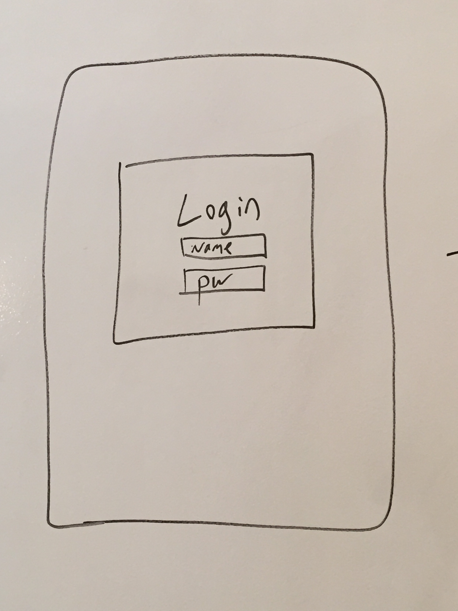
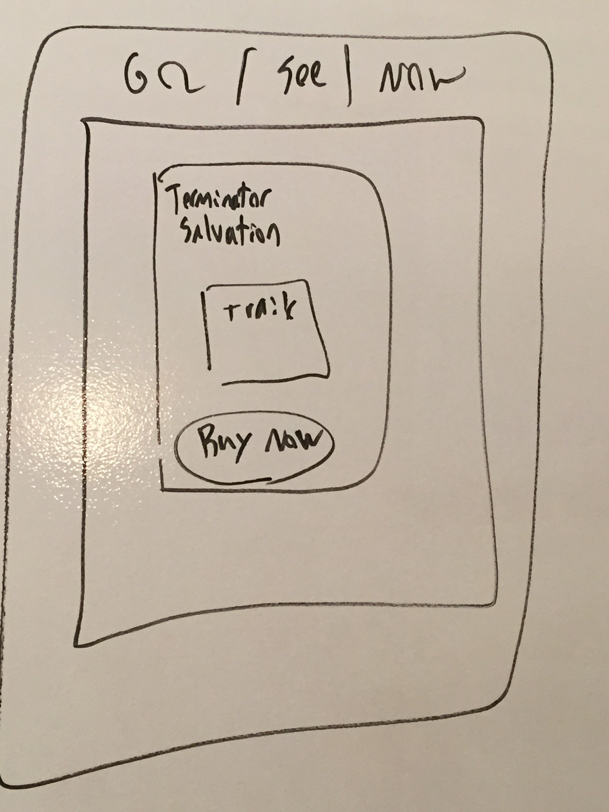

**Go Now**

This application is a mobile-friendly, location-based movie finder for people that don't want to search to find a movie, but want to **Go** see something right **Now**!

We will pull theatre information in from the Dealflicks api, maps from the Google Maps api and additional general movie information from the Tmdb api.

**User Stories**

After creating an account and logging in, users will be able to:

- Quickly find a movie playing soon and close to their location, based on start time and theatre location.
- Primary view is based on the **Now** tab- which shows movies by soonest start time laid over a Google Map, but a user can quickly switch to the **Go** tab to show movies by distance away from their actual location.
- Search for a specific movie if not already shown.
- Link to the Fandango or MovieTickets site to order the tickets.

**Technologies**

The application will be built using the Node and Express libraries, HTML, CSS, JavaScript/ jQuery, Boostrap, and Ionic. We are using Mongo DB as our database, through online solution MongoLab. The app wil be deployed through AWS and Ionic.

We are managing team interactions through:

- A team Github repo, with each team member creating their own clone and branches and pushes.
	
- A Trello board divided into the following sections: Backlog, Assigned, Doing, Awaiting Approval, Approved, and Done.

**Models**

The application will be comprised of only 1 model for our MVP. We may include a 2nd model if we decide to incorporate searches.

**User** 
The User model will include each authenticated member's information:

- username
- email

**Wireframes**

Basic wireframes are included.

The 1st wireframe shows the Login page:

The 2nd wireframe shows the Now view page:

The 3rd wireframe shows the Detail view page:

